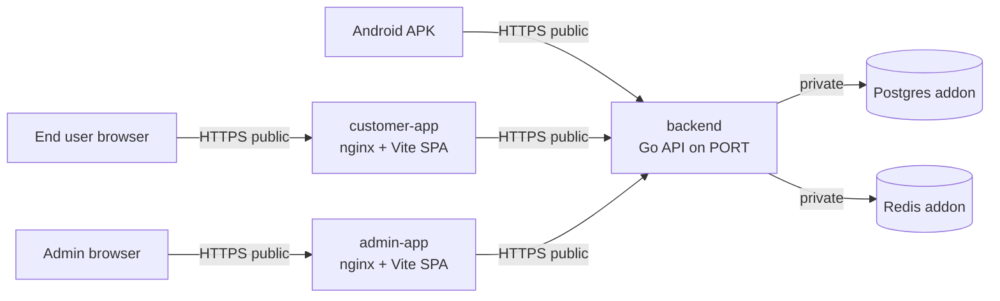

# SavingPlus Deployment Guide

This guide is the canonical deployment runbook for SavingPlus. The primary path
is **Railway** (5 services in one project). A single-VM/nginx alternative is
preserved in the appendix for reference.

---

## 1. Architecture

Five services in one Railway project. The two databases are private to the
project network; the three application services each get a public HTTPS domain.



| Service | Source | Builder | Public? |
|---------|--------|---------|---------|
| Postgres | Railway addon | — | No (private only) |
| Redis | Railway addon | — | No (private only) |
| backend | `backend/` | Dockerfile | Yes |
| customer-app | `frontend/customer-app/` | Dockerfile (nginx) | Yes |
| admin-app | `frontend/admin-app/` | Dockerfile (nginx) | Yes |

Key facts that shape the rest of this guide:

- **Single-port mode**: when `SERVER_PORT == ADMIN_SERVER_PORT`, the Go API
  serves customer + admin endpoints on the same port. See
  [backend/cmd/api/main.go](../backend/cmd/api/main.go) (`singlePort := ...`).
  Railway only exposes one port per service (`$PORT`), so we use this mode.
- **Migrations auto-run on startup** via `runMigrations(database)` in
  [backend/cmd/api/main.go](../backend/cmd/api/main.go). No separate migration
  step is needed on Railway.
- **CORS** in [backend/internal/middleware/cors.go](../backend/internal/middleware/cors.go)
  reflects the request `Origin` header, so no allowlist env var is required.
- The frontends are **static SPAs served by nginx**. The API URL is **baked
  into the JS bundle at build time** via `VITE_API_URL`. The frontends must be
  pointed at the **public** backend URL — no `BACKEND_URL` reverse proxy is
  wired into [frontend/customer-app/nginx.conf](../frontend/customer-app/nginx.conf).

---

## 2. Pre-deployment checklist

### 2.1 Generate production secrets

Run these locally and keep the output — you will paste them into Railway env
vars in step 4.

```bash
# 64-hex-char JWT signing secret
openssl rand -hex 32

# 32-byte AES-256 encryption key (also 64 hex chars)
openssl rand -hex 32
```

### 2.2 Confirm Flutter API URL is configurable

The mobile client reads its base URL from `--dart-define=API_BASE_URL=...` at
build time. The relevant code lives in
[savingplus/lib/core/api/api_client.dart](../savingplus/lib/core/api/api_client.dart):

```dart
static const String _envBaseUrl =
    String.fromEnvironment('API_BASE_URL', defaultValue: '');
```

When `API_BASE_URL` is empty (local dev), it falls back to `localhost` /
LAN IP. When set at build time (production APK), it overrides everything.

### 2.3 Push the repo to GitHub

Railway pulls from GitHub. Make sure your latest changes are on a branch
Railway can read (usually `main`).

---

## 3. Provision Postgres and Redis

1. Go to [railway.app](https://railway.app), click **New Project** → **Empty Project**.
2. Inside the project: `+ New` → **Database** → **Add PostgreSQL**.
   This auto-creates the env vars `PGHOST`, `PGPORT`, `PGUSER`, `PGPASSWORD`,
   `PGDATABASE`.
3. `+ New` → **Database** → **Add Redis**.
   This auto-creates `REDISHOST`, `REDISPORT`, `REDISPASSWORD`.

You don't need to expose either addon publicly — leave their networking
settings as default (private-only).

---

## 4. Deploy the backend

### 4.1 Create the service

1. `+ New` → **GitHub Repo** → pick this repo.
2. Open the service → **Settings**:
   - **Service Name**: `backend`
   - **Root Directory**: `backend`
   - **Builder**: auto-detected from
     [backend/railway.json](../backend/railway.json) (`DOCKERFILE`).

### 4.2 Set environment variables

In **Settings → Variables**, add each row below. Values like
`${{Postgres.PGHOST}}` are Railway reference variables that resolve to the
addon's value automatically.

| Variable | Value |
|----------|-------|
| `SERVER_PORT` | `${{PORT}}` |
| `ADMIN_SERVER_PORT` | `${{PORT}}` |
| `ENV` | `production` |
| `LOG_LEVEL` | `info` |
| `DB_HOST` | `${{Postgres.PGHOST}}` |
| `DB_PORT` | `${{Postgres.PGPORT}}` |
| `DB_USER` | `${{Postgres.PGUSER}}` |
| `DB_PASSWORD` | `${{Postgres.PGPASSWORD}}` |
| `DB_NAME` | `${{Postgres.PGDATABASE}}` |
| `DB_SSLMODE` | `require` |
| `REDIS_HOST` | `${{Redis.REDISHOST}}` |
| `REDIS_PORT` | `${{Redis.REDISPORT}}` |
| `REDIS_PASSWORD` | `${{Redis.REDISPASSWORD}}` |
| `JWT_SECRET` | (output of `openssl rand -hex 32`) |
| `ENCRYPTION_KEY` | (output of `openssl rand -hex 32`) |
| `PAYMENT_GATEWAY` | `mock` |
| `TOTP_ISSUER` | `SavingPlus` |
| `STEPUP_THRESHOLD` | `100000` |
| `RATE_LIMIT_PER_SECOND` | `30` |
| `RATE_LIMIT_PER_MINUTE` | `300` |

Notes:
- `SERVER_PORT` and `ADMIN_SERVER_PORT` are intentionally equal so the
  service starts in single-port mode (see section 1).
- `DB_SSLMODE=require` is mandatory for the Railway Postgres addon.
- When you wire a real payment gateway, set `PAYMENT_GATEWAY=cellulant`
  (or your provider name) plus the matching `CELLULANT_*` variables read in
  [backend/pkg/config/config.go](../backend/pkg/config/config.go).

### 4.3 Generate a public domain

**Settings → Networking → Generate Domain**. Note the URL, e.g.
`savingplus-backend-production.up.railway.app`. You will reference it as
`<BACKEND_URL>` in the rest of this guide.

### 4.4 Verify the deploy

```bash
curl https://<BACKEND_URL>/health
# => {"status":"ok","service":"savingplus-api","time":"..."}
```

Migrations from `backend/migrations/` are applied automatically on first boot.
Check the **Deployments → Logs** tab for `Migration applied successfully`
lines.

### 4.5 Seed the first admin user (one-time)

The seed binary (`./savingplus-seed`) is baked into the image by
[backend/Dockerfile](../backend/Dockerfile). Run it once from your laptop:

```bash
# Install + auth Railway CLI (one-time)
npm i -g @railway/cli
railway login
railway link            # pick the SavingPlus project

# Seed
railway run --service backend ./savingplus-seed
```

Default credentials it prints:
`admin@savingplus.co.tz` / `Admin@123456` / any 6-digit MFA code (dev mode).
**Change this password immediately** after first login.

---

## 5. Deploy the customer web app

### 5.1 Create the service

1. `+ New` → **GitHub Repo** → same repo.
2. **Settings**:
   - **Service Name**: `customer-app`
   - **Root Directory**: `frontend/customer-app`
   - Builder auto-detected from
     [frontend/customer-app/railway.json](../frontend/customer-app/railway.json).

### 5.2 Set the build-time API URL

`VITE_API_URL` is consumed by the multi-stage build in
[frontend/customer-app/Dockerfile](../frontend/customer-app/Dockerfile) (`ARG
VITE_API_URL`) and inlined into the JS bundle. It must be set **before** the
build runs.

In **Settings → Variables**, add:

| Variable | Value |
|----------|-------|
| `VITE_API_URL` | `https://<BACKEND_URL>/api/v1` |

Railway automatically passes service-scope variables as Docker build args, so
no extra config is needed.

### 5.3 Generate a public domain

**Settings → Networking → Generate Domain**, e.g.
`savingplus-app-production.up.railway.app`.

### 5.4 Smoke test

Open the URL in a browser. Open DevTools → Network. Register a phone number
and confirm requests hit `https://<BACKEND_URL>/api/v1/...` with `200`s. OTPs
in `PAYMENT_GATEWAY=mock` mode are printed to backend logs (`railway logs
--service backend`).

---

## 6. Deploy the admin web app

Identical pattern to section 5, with one different URL.

1. `+ New` → **GitHub Repo** → same repo.
2. **Settings**:
   - **Service Name**: `admin-app`
   - **Root Directory**: `frontend/admin-app`
3. **Variables**:

| Variable | Value |
|----------|-------|
| `VITE_API_URL` | `https://<BACKEND_URL>/api/v1/admin` |

4. **Networking → Generate Domain**, e.g.
   `savingplus-admin-production.up.railway.app`.
5. Smoke test: open the URL, log in with the seeded admin credentials, confirm
   the dashboard loads.

---

## 7. Build the Android APK

Target: a release-build APK signed with the **debug keystore** — installs on
any Android device via sideload, but is **not** Play Store ready. (For Play
Store, see section 9.)

### 7.1 Prerequisites

- Flutter SDK ≥ 3.11 (matches [savingplus/pubspec.yaml](../savingplus/pubspec.yaml)
  `sdk: ^3.11.4`)
- Android SDK + build-tools (`flutter doctor` should be all green for Android)
- JDK 17

### 7.2 Build

```bash
cd savingplus
flutter clean
flutter pub get
flutter build apk --release \
  --dart-define=API_BASE_URL=https://<BACKEND_URL>/api/v1
```

The `--dart-define` value is read by `ApiConfig._envBaseUrl` in
[savingplus/lib/core/api/api_client.dart](../savingplus/lib/core/api/api_client.dart)
and overrides the local-dev fallbacks.

Output:
```
savingplus/build/app/outputs/flutter-apk/app-release.apk
```

### 7.3 Smaller per-ABI APKs (optional)

```bash
flutter build apk --release --split-per-abi \
  --dart-define=API_BASE_URL=https://<BACKEND_URL>/api/v1
```

Produces three APKs (`armeabi-v7a`, `arm64-v8a`, `x86_64`) — each ~30–40%
smaller than the universal APK.

### 7.4 Install on a device

```bash
# Phone must have USB debugging enabled
adb install -r savingplus/build/app/outputs/flutter-apk/app-release.apk
```

Or copy the APK to the phone and tap to install (requires "Install unknown
apps" permission for the file manager).

### 7.5 Distribute (no Play Store)

Upload `app-release.apk` to any HTTPS-served location (Firebase App
Distribution, a private GitHub Release, S3 with signed URLs, etc.) and share
the link with testers.

---

## 8. Operations

### 8.1 Viewing logs

```bash
railway logs --service backend
railway logs --service customer-app
railway logs --service admin-app
```

Or use **Deployments → Logs** in the Railway dashboard. Logs are JSON-formatted
by [backend/cmd/api/main.go](../backend/cmd/api/main.go) `setupLogging`.

### 8.2 Running one-off commands

```bash
# Re-seed admin / reset MFA
railway run --service backend ./savingplus-seed

# Open a psql shell against production DB
railway connect Postgres
```

### 8.3 Redeploys

- **Auto**: pushing to the connected branch triggers a deploy.
- **Manual**: Deployments tab → `...` menu → **Redeploy**.
- **Rollback**: Deployments tab → pick an older successful deploy →
  **Redeploy**.

### 8.4 Rotating secrets

1. Generate a new value (`openssl rand -hex 32`).
2. **Settings → Variables**, replace `JWT_SECRET` / `ENCRYPTION_KEY`.
3. Railway redeploys automatically. Note that rotating `JWT_SECRET` invalidates
   all currently-issued access and refresh tokens — every user must log in
   again.

### 8.5 Scaling

- **Vertical**: Service → Settings → Resources → adjust CPU/RAM.
- **Horizontal**: enable **Replicas**. The backend is stateless except for the
  Asynq worker — running multiple replicas is safe because the queue is in
  Redis.

### 8.6 Backups

Railway's managed Postgres takes automatic daily snapshots (visible under the
Postgres service → Backups tab). For higher-frequency backups, schedule
`pg_dump` from an external host using the Postgres connection string.

---

## 9. Production hardening checklist

Before letting real customers onto the platform:

- [ ] Replace placeholder `applicationId` `com.example.savingplus` in
      [savingplus/android/app/build.gradle.kts](../savingplus/android/app/build.gradle.kts)
      with a real bundle ID you own.
- [ ] Replace the debug `signingConfig` in the same file with a proper
      release keystore stored outside the repo. Required for Play Store.
- [ ] Build an `.aab` (`flutter build appbundle --release --dart-define=...`)
      for Play Store upload instead of an APK.
- [ ] Switch `PAYMENT_GATEWAY` from `mock` to a real provider and set its
      credentials.
- [ ] Configure SendGrid / Africa's Talking env vars
      (`SENDGRID_API_KEY`, `AT_API_KEY`, …) so OTPs and notifications go to
      real channels instead of logs.
- [ ] Enable MFA for every admin user.
- [ ] Move the backend domain behind a real domain (e.g. `api.savingplus.co.tz`)
      via **Settings → Networking → Custom Domain** and update
      `VITE_API_URL` on both frontends.
- [ ] Set up an external uptime probe (BetterStack / UptimeRobot) hitting
      `/health`.
- [ ] Set up log shipping or an APM (Datadog, Grafana Cloud, Sentry).

---

## Appendix A: Single-VM deployment with nginx

The original deployment path — kept here for reference. Use this when you
need full control of the host or want to avoid managed-platform pricing.

### A.1 Server setup

```bash
# Ubuntu 22.04 recommended
sudo apt update && sudo apt upgrade -y
sudo apt install -y docker.io docker-compose nginx certbot python3-certbot-nginx
sudo systemctl enable docker
sudo usermod -aG docker $USER
```

### A.2 SSL certificate

```bash
sudo certbot --nginx \
  -d api.savingplus.co.tz \
  -d admin.savingplus.co.tz \
  -d app.savingplus.co.tz
```

### A.3 nginx configuration

`/etc/nginx/sites-available/savingplus`:

```nginx
# Customer API
server {
    listen 443 ssl http2;
    server_name api.savingplus.co.tz;

    ssl_certificate /etc/letsencrypt/live/api.savingplus.co.tz/fullchain.pem;
    ssl_certificate_key /etc/letsencrypt/live/api.savingplus.co.tz/privkey.pem;
    ssl_protocols TLSv1.3;

    location / {
        proxy_pass http://127.0.0.1:8080;
        proxy_set_header Host $host;
        proxy_set_header X-Real-IP $remote_addr;
        proxy_set_header X-Forwarded-For $proxy_add_x_forwarded_for;
        proxy_set_header X-Forwarded-Proto $scheme;
    }
}

# Admin API
server {
    listen 443 ssl http2;
    server_name admin.savingplus.co.tz;

    ssl_certificate /etc/letsencrypt/live/admin.savingplus.co.tz/fullchain.pem;
    ssl_certificate_key /etc/letsencrypt/live/admin.savingplus.co.tz/privkey.pem;
    ssl_protocols TLSv1.3;

    # Optional: IP whitelist for admin
    # allow 196.x.x.x;
    # deny all;

    location / {
        proxy_pass http://127.0.0.1:8081;
        proxy_set_header Host $host;
        proxy_set_header X-Real-IP $remote_addr;
    }
}

# Customer Web App
server {
    listen 443 ssl http2;
    server_name app.savingplus.co.tz;

    ssl_certificate /etc/letsencrypt/live/app.savingplus.co.tz/fullchain.pem;
    ssl_certificate_key /etc/letsencrypt/live/app.savingplus.co.tz/privkey.pem;
    ssl_protocols TLSv1.3;

    root /var/www/savingplus/customer-app/dist;
    index index.html;

    location / {
        try_files $uri $uri/ /index.html;
    }

    location /api {
        proxy_pass http://127.0.0.1:8080;
    }
}
```

### A.4 Deploy

```bash
git clone <repo-url> /opt/savingplus
cd /opt/savingplus

cp backend/.env.example backend/.env
# Edit with production values (strong secrets, real API keys, etc.)

docker-compose -f docker-compose.yml up -d

cd frontend/customer-app && npm ci && npm run build
sudo cp -r dist /var/www/savingplus/customer-app/

cd ../admin-app && npm ci && npm run build
sudo cp -r dist /var/www/savingplus/admin-app/

sudo systemctl restart nginx
```

### A.5 VM security checklist

- [ ] Strong unique `JWT_SECRET` (64+ random chars)
- [ ] Unique `ENCRYPTION_KEY` (32 random bytes, hex-encoded)
- [ ] TLS 1.3 only
- [ ] Firewall allows 80 and 443 only
- [ ] PostgreSQL SSL enabled
- [ ] Redis password set
- [ ] Admin panel IP-whitelisted
- [ ] Log rotation configured
- [ ] Prometheus + Grafana for monitoring
- [ ] Automated `pg_dump` backups
- [ ] MFA enforced for all admin users
